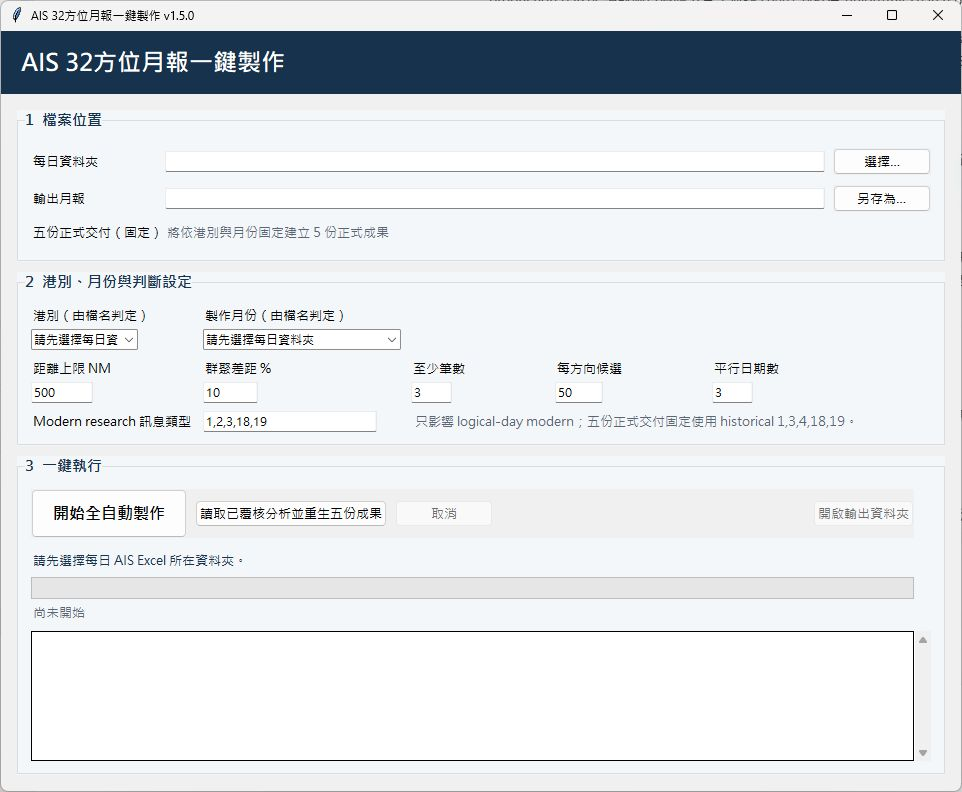

# AIS 32 方位月報一鍵製作

[](https://github.com/tomoya034/ais-32-direction-monthly-report/actions/workflows/tests.yml)
[](https://github.com/tomoya034/ais-32-direction-monthly-report/releases/latest)
[](LICENSE)

離線讀取每日 `D&TMOK <PORT>_YYYYMMDD_*.xlsx` AIS 資料，自動辨識港別與年月，依 32 方位進行資料整理與選值，並產生新版自動分析與原格式相容版 Excel 月報。

程式完全離線執行，不使用雲端 API、不需要 Token，也不會上傳原始 AIS 資料。



## 📥 下載

前往 [GitHub Releases](https://github.com/tomoya034/ais-32-direction-monthly-report/releases/latest) 取得最新正式版本。

一般 Windows 使用者請下載 Release 頁面中標示的 Windows 執行版或正式 Windows 發布包；`Source code (zip)` 與 `Source code (tar.gz)` 是 GitHub 自動產生的原始碼封裝，並非一般使用者的執行版。

Windows 可能因程式尚未進行商業程式碼簽章而顯示「未知發行者」。請只從本專案 GitHub Release 下載，並依 Release 提供的 SHA-256 驗證檔案。

## 🚀 快速開始

1. 下載最新 Windows 執行版；若為 ZIP，先解壓縮。
2. 執行 `AIS_32方位月報工具.exe`。
3. 選擇包含每日 AIS Excel 的來源資料夾。
4. 程式自動掃描可用港別與月份；多港或多月份時可由下拉選單選擇。
5. 視需求保持勾選「同時產生原格式相容版」。
6. 按下「開始全自動製作」。
7. 完成後先查看新版工作簿中的「待複核」工作表。

## 📄 輸入資料

每日來源檔案需符合：

```text
D&TMOK <PORT>_YYYYMMDD_*.xlsx
```

例如：

```text
D&TMOK KLNG_20260701_23.xlsx
D&TMOK HWLN_20260101_23.xlsx
```

程式會從檔名取得港別與日期。港別代碼目前採 2–16 位英數字、第一個字元為英文字母，大小寫不敏感並統一轉為大寫；支援範圍沒有寫死為 KLNG 或 HWLN。

核心使用欄位包含：

- `msg_type`
- `LONGITUDE_DESC`
- `bearing`
- `distance in nautical miles`

如果活頁簿第一頁為封面或說明頁，程式會自動尋找含必要欄位的 AIS 資料工作表。

## 📊 輸出內容

### 新版自動分析

檔名格式：

```text
<PORT>_YYYY年MM月_32方位數值_新版自動分析.xlsx
```

包含操作說明、每日候選、數值化判定理由、人工覆核欄、總表、待複核、處理紀錄與圖表，並保留候選資料與來源列號供後續查核。

### 原格式相容版

檔名格式：

```text
<PORT>_YYYY年MM月_32方位數值_原格式相容版.xlsx
```

包含每日 A:C 完整排序資料、H:AM 第 2 列 32 方位結果、舊式總表、圖表及隱藏的「工作」對照表，用於維持既有研究 Excel 作業格式相容性。

## ⚙️ 處理流程

```text
每日 D&TMOK Excel
        ↓
自動辨識港別與年月
        ↓
尋找 AIS 資料工作表
        ↓
篩選 msg_type / East / bearing / distance
        ↓
依 bearing 分為 32 方位
        ↓
套用距離與群聚選值規則
        ↓
產生每日代表值
        ↓
建立新版分析工作簿
        ↓
人工複核
        ↓
月總表與圖表
```

若產生原格式相容版，通過篩選的完整明細會先寫入 legacy binary spool，再建立相容工作簿。原始每日 AIS Excel 只會讀取，不會被程式修改。

## 🧭 預設數值規則

- AIS 船舶位置訊息類型：`1, 2, 3, 18, 19`
- `LONGITUDE_DESC = East`
- 自動值距離上限：500 NM；超過者保留統計但不採用
- 每個方向由高至低尋找第一組「至少 3 筆、落在最高值 10% 範圍內」的群聚
- 僅產出目前研究使用的 21 個海向方位
- 西南西、西微南、西高於 10 NM 時列入待複核
- 每方向在新版保留前 50 筆候選與來源列號

完整演算法與原格式相容方式請見 [`docs/ALGORITHM.md`](docs/ALGORITHM.md)。

## 🏷️ 港別與月份自動辨識

程式將來源資料整理為 `PORT → YYYY-MM → 每日 Excel`。

- 只有一個港別時自動選取
- 多港資料夾可從港別下拉選單選擇
- 切換港別時月份清單同步更新
- 同港多月份時預選最新月份並允許改選
- 開始製作前重新掃描來源資料，重新核對港別、年月與每日檔
- 同一份月報只處理一個港別

## 🔍 人工複核與已知限制

自動分析用於減少逐日、逐方向的人工篩選與複製工作，但不取代領域人員判斷。完成月報後仍應先查看「待複核」工作表。

目前部分研究規格仍屬待確認事項，例如：

- 32 方位邊界的最終研究定義
- 21 個海向的研究依據
- AIS 重複紀錄是否需要去重
- D&TMOK 上游 `bearing` / `distance` 計算方式
- 時區與固定基點規格

程式保留既有研究規則，不自行推定或修改上述內容。

## 💾 快取與錯誤處理

- 每完成一天即保存快取，相同來源與設定重跑時可接續尚未完成日期
- Cache 與 legacy spool 依港別、年份及月份隔離
- 原格式相容版使用逐日二進位暫存，避免再次讀取大型來源 Excel
- 會檢查缺少欄位、檔案損壞、月份不符、Excel 鎖檔、磁碟不足、記憶體不足、列數超限與平行程序失敗
- 失敗時會在輸出位置建立 `AIS月報_錯誤報告_*.txt`

## ⌨️ 從命令列執行

需求：Windows、Python 3.11 以上。

```powershell
python -m venv .venv
.\.venv\Scripts\Activate.ps1
python -m pip install -r requirements.txt
python .\ais_monthly_app.py
```

來源只有一個港別／月份時：

```powershell
python .\ais_monthly_app.py `
  --input "D:\AIS\2026_01" `
  --output "D:\AIS\HWLN_2026年01月_32方位數值_新版自動分析.xlsx" `
  --legacy-output "D:\AIS\HWLN_2026年01月_32方位數值_原格式相容版.xlsx" `
  --workers 2 --overwrite
```

若來源資料夾含多個港別，可使用：

```text
--port HWLN
```

同一港別含多個月份時可成對指定 `--year` 與 `--month`。

## 🧪 測試

```powershell
python -m unittest -v test_ais_monthly_app.py
```

測試會在暫存資料夾建立小型合成 AIS 資料，不需要真實 AIS 原始檔。具體測試數與每版驗證結果請見該版本 GitHub Release。

## 🪟 建置 Windows EXE

```powershell
.\scripts\build_windows.ps1
```

建置結果位於：

```text
dist\AIS_32方位月報工具.exe
```

## 🔒 資料保護

本工具以離線處理為原則，不使用雲端 API、不需要 API Key 或 Token，也不會自動上傳 AIS 資料。

`.gitignore` 預設排除 Excel、CSV、cache、binary spool、錯誤報告與 build artifacts。請勿將真實 AIS 原始資料、含船舶識別資訊的工作簿或其他敏感研究資料上傳至 GitHub Issue、Pull Request、Release 或 Repository。

## 📋 版本紀錄

完整版本變更請見 [`CHANGELOG.md`](CHANGELOG.md)。

最新正式版本與下載檔請見 [GitHub Releases](https://github.com/tomoya034/ais-32-direction-monthly-report/releases/latest)。

發布格式與維護規範請見 [`docs/RELEASE_TEMPLATE.md`](docs/RELEASE_TEMPLATE.md)。

## 📄 License

本專案採用 [MIT License](LICENSE)。
